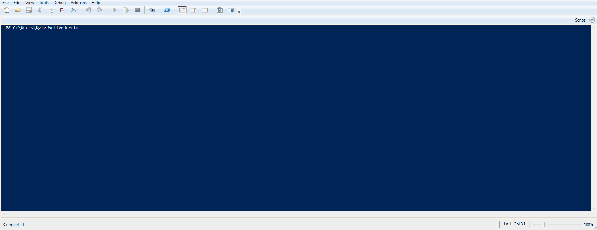
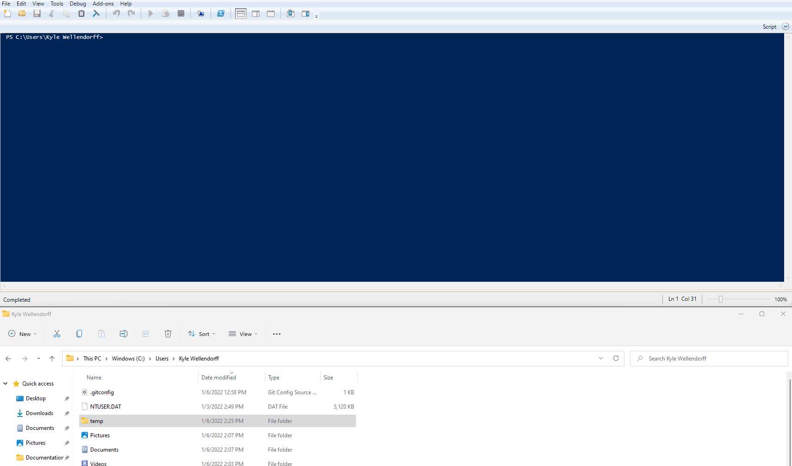
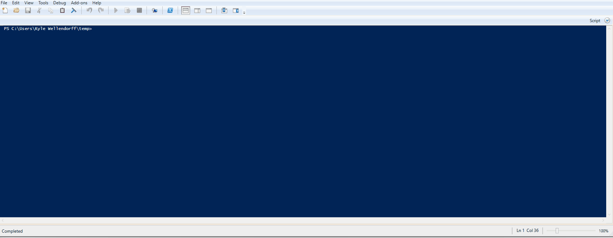
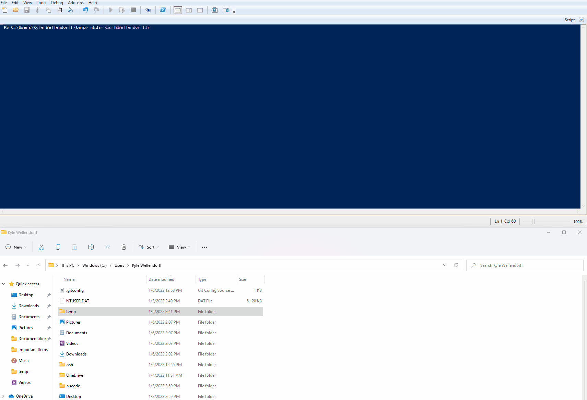
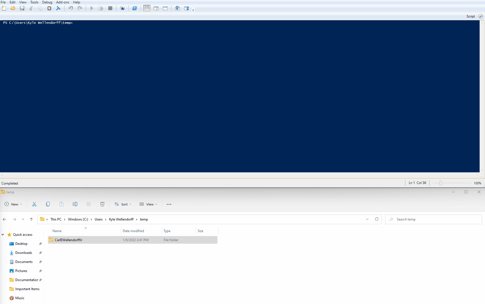
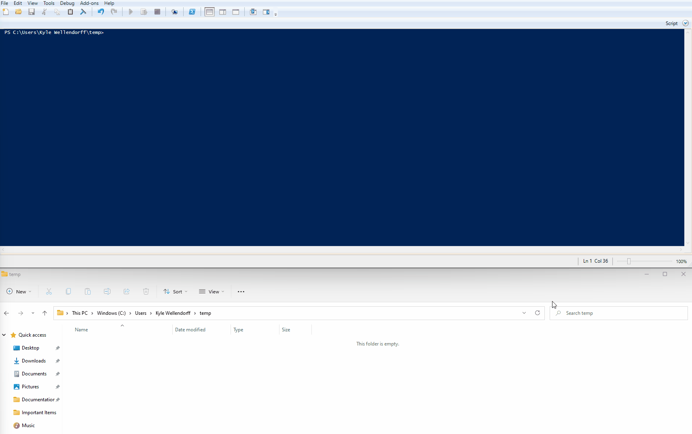
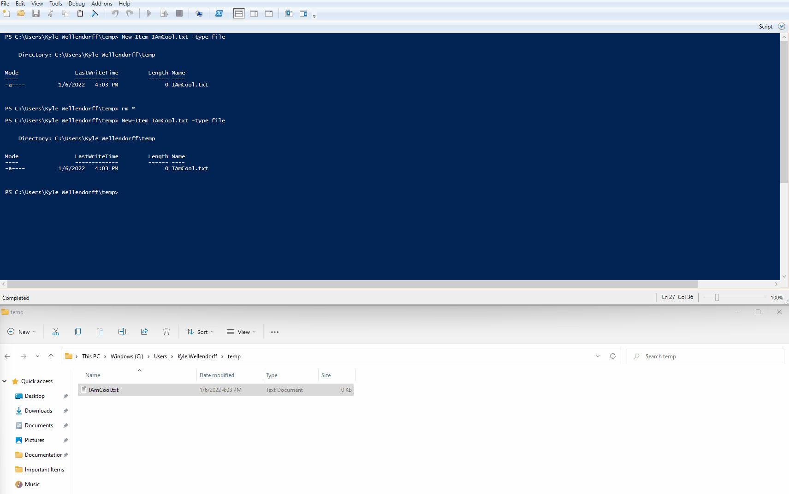
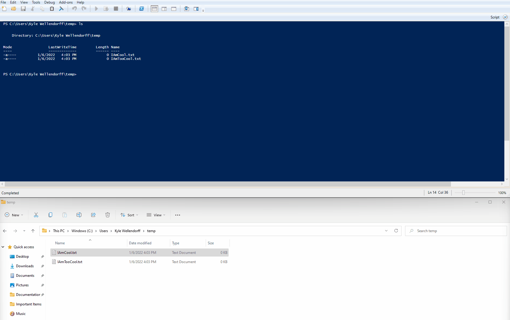

# Command Line Cheat Sheet
---
### Windows
Within PowerShell or a Linux WSL (windows sub-system for linux) 
> NOTE: some commands do and dont work in Windows Command Prompt

1. **pwd** - Print Whole Directory
   
    

2. **cd** - Change Working Directory
   > within your working directory you can run `ls` to list all the files/folders downstream to where you are. then you can use `cd` to change to the desired location. Use `cd ..` to go UP one directory
   - I used `ls` to list out the folders, and then changed my working directory to the "C:\Users\Kyle Wellendorff\temp" folder. While typing the destination folder, you can hit TAB to auto-complete if available  
  

    

3. **hostname** - Print out local Host Name (computer name)

    

4. **mkdir** - Makes Directories in reference to your working directory. If you arent sure of which Workig dir you are inm run `pwd`
   >You can create multiple directories at once by passiong in multiple folders to the `mkdir` command. EX. mkdir 1/2/3/4/5 would go 5 sub-folders deep (from your working directory)

    


    
5. **rmdir** - Removes a directory. Relative to your working directory 
    > I used `tree` to list out the folders and subfolders downstream of my working directory (NOTE: Prints everything so do not run in an environment with lots of folders and files. worked great in this example case. I wanted to remove all the directories in `\TEMP`)
    >In 

    

6. **Create an Emtpy File**
   >In practice, not very useful. Equivalent to `TOUCH` in Linux
   
   >`New-Item IAmCool.txt -type file`

    


7. **cp** - Copy or rename a file: `cp IAmCool.txt IAmTooCool.txt`

    

8. **rm** - Remove a file. In reference to your working directory
    ```
    Can run `rm filename` or `rm *` to remove all files from a direcory. Be CAREFUL
    ```


    


